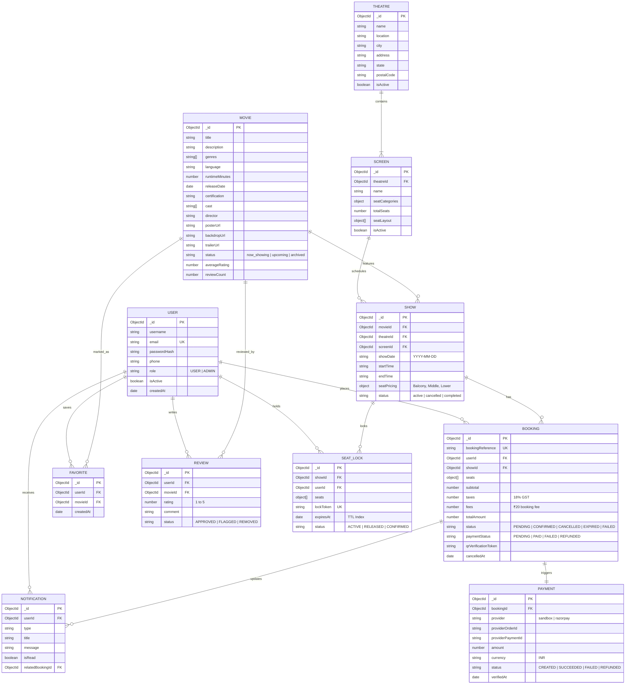

# Entity Relationship (ER) Diagram

```mermaid
erDiagram
    USER ||--o{ BOOKING : places
    USER ||--o{ FAVORITE : saves
    USER ||--o{ REVIEW : writes
    USER ||--o{ NOTIFICATION : receives
    USER ||--o{ SEAT_LOCK : holds

    THEATRE ||--|{ SCREEN : contains
    SCREEN ||--o{ SHOW : schedules
    MOVIE ||--o{ SHOW : features
    MOVIE ||--o{ FAVORITE : marked_as
    MOVIE ||--o{ REVIEW : reviewed_by

    SHOW ||--o{ BOOKING : has
    SHOW ||--o{ SEAT_LOCK : locks
    BOOKING ||--|| PAYMENT : triggers
    BOOKING ||--o{ NOTIFICATION : updates

    USER {
        ObjectId _id PK
        string username
        string email UK
        string passwordHash
        string phone
        string role "USER | ADMIN"
        boolean isActive
        date createdAt
    }

    MOVIE {
        ObjectId _id PK
        string title
        string description
        string[] genres
        string language
        number runtimeMinutes
        date releaseDate
        string certification
        string[] cast
        string director
        string posterUrl
        string backdropUrl
        string trailerUrl
        string status "now_showing | upcoming | archived"
        number averageRating
        number reviewCount
    }

    THEATRE {
        ObjectId _id PK
        string name
        string location
        string city
        string address
        string state
        string postalCode
        boolean isActive
    }

    SCREEN {
        ObjectId _id PK
        ObjectId theatreId FK
        string name
        object seatCategories
        number totalSeats
        object[] seatLayout
        boolean isActive
    }

    SHOW {
        ObjectId _id PK
        ObjectId movieId FK
        ObjectId theatreId FK
        ObjectId screenId FK
        string showDate "YYYY-MM-DD"
        string startTime
        string endTime
        object seatPricing "Balcony, Middle, Lower"
        string status "active | cancelled | completed"
    }

    SEAT_LOCK {
        ObjectId _id PK
        ObjectId showId FK
        ObjectId userId FK
        object[] seats
        string lockToken UK
        date expiresAt "TTL Index"
        string status "ACTIVE | RELEASED | CONFIRMED"
    }

    BOOKING {
        ObjectId _id PK
        string bookingReference UK
        ObjectId userId FK
        ObjectId showId FK
        object[] seats
        number subtotal
        number taxes "18% GST"
        number fees "₹20 booking fee"
        number totalAmount
        string status "PENDING | CONFIRMED | CANCELLED | EXPIRED | FAILED"
        string paymentStatus "PENDING | PAID | FAILED | REFUNDED"
        string qrVerificationToken
        date cancelledAt
    }

    PAYMENT {
        ObjectId _id PK
        ObjectId bookingId FK
        string provider "sandbox | razorpay"
        string providerOrderId
        string providerPaymentId
        number amount
        string currency "INR"
        string status "CREATED | SUCCEEDED | FAILED | REFUNDED"
        date verifiedAt
    }

    REVIEW {
        ObjectId _id PK
        ObjectId userId FK
        ObjectId movieId FK
        number rating "1 to 5"
        string comment
        string status "APPROVED | FLAGGED | REMOVED"
    }

    FAVORITE {
        ObjectId _id PK
        ObjectId userId FK
        ObjectId movieId FK
        date createdAt
    }

    NOTIFICATION {
        ObjectId _id PK
        ObjectId userId FK
        string type
        string title
        string message
        boolean isRead
        ObjectId relatedBookingId FK
    }
```
