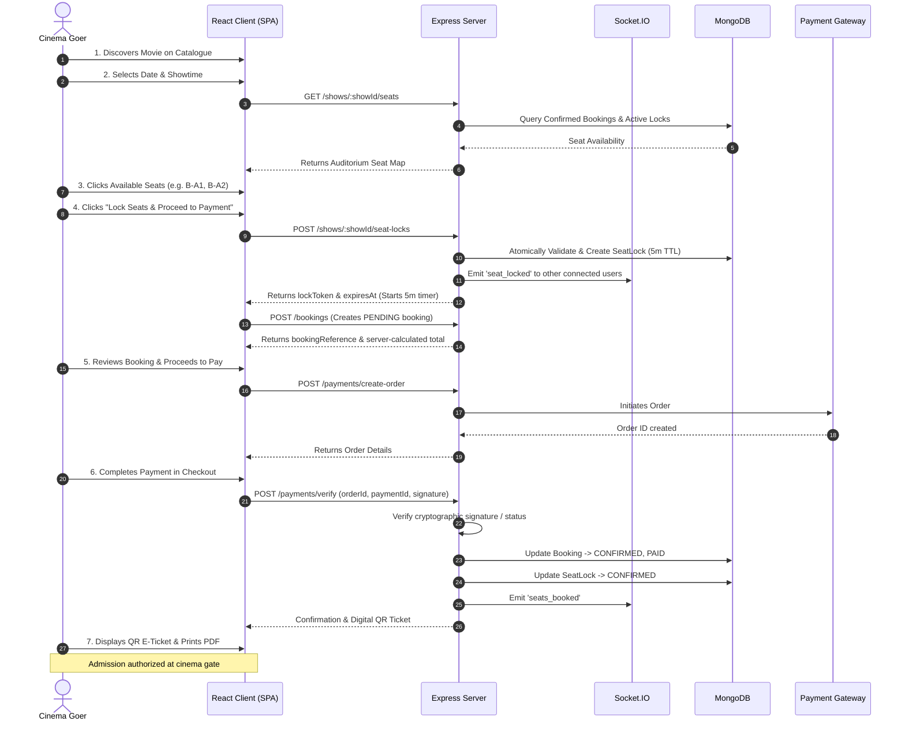

# IMovies Complete User Flow

```mermaid
sequenceDiagram
    autonumber
    actor User as Cinema Goer
    participant Client as React Client (SPA)
    participant Server as Express Server
    participant Socket as Socket.IO
    participant DB as MongoDB
    participant Payment as Payment Gateway

    User->>Client: 1. Discovers Movie on Catalogue
    User->>Client: 2. Selects Date & Showtime
    Client->>Server: GET /shows/:showId/seats
    Server->>DB: Query Confirmed Bookings & Active Locks
    DB-->>Server: Seat Availability
    Server-->>Client: Returns Auditorium Seat Map

    User->>Client: 3. Clicks Available Seats (e.g. B-A1, B-A2)
    User->>Client: 4. Clicks "Lock Seats & Proceed to Payment"
    Client->>Server: POST /shows/:showId/seat-locks
    Server->>DB: Atomically Validate & Create SeatLock (5m TTL)
    Server->>Socket: Emit 'seat_locked' to other connected users
    Server-->>Client: Returns lockToken & expiresAt (Starts 5m timer)

    Client->>Server: POST /bookings (Creates PENDING booking)
    Server-->>Client: Returns bookingReference & server-calculated total

    User->>Client: 5. Reviews Booking & Proceeds to Pay
    Client->>Server: POST /payments/create-order
    Server->>Payment: Initiates Order
    Payment-->>Server: Order ID created
    Server-->>Client: Returns Order Details

    User->>Client: 6. Completes Payment in Checkout
    Client->>Server: POST /payments/verify (orderId, paymentId, signature)
    Server->>Server: Verify cryptographic signature / status
    Server->>DB: Update Booking -> CONFIRMED, PAID
    Server->>DB: Update SeatLock -> CONFIRMED
    Server->>Socket: Emit 'seats_booked'
    Server-->>Client: Confirmation & Digital QR Ticket

    User->>Client: 7. Displays QR E-Ticket & Prints PDF
    Note over User,Client: Admission authorized at cinema gate
```
